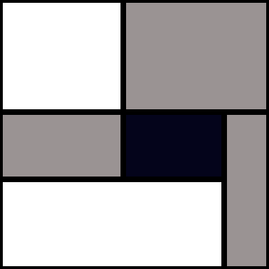

# Project Context: Static Web Tools

## Overview
- **Type:** Collection of static, self-contained HTML/JS tools.
- **Hosting:** Cloudflare Pages (`tools.ddanieltan.dev`).
- **Goal:** Lightweight, mobile-friendly, single-file tools without build steps.

## Architecture & Structure
- **Path:** `/{tool-name}/index.html` (Entry point).
- **Assets:** `/{tool-name}/art.svg` (Icon/Logo).
- **Code Style:** HTML, CSS, and JS all in `index.html`. No external local dependencies.
- **Libraries:** Use CDNs (cdnjs, jsdelivr) for libraries (React, Vue, etc. if strictly needed, but vanilla preferred for simple tools).

## UI/UX Standards
- **Layout:** Centered, max-width (~800px), responsive (mobile-first or adaptable).
- **Styling:** Minimal, clean. `box-sizing: border-box`.
- **Interactions:** Real-time (on input), drag-and-drop, clipboard operations.
- **Feedback:** Loading states, clear error messages.

## Development
- **Run:** `python -m http.server 8080`
- **Conventions:**
    - Use `<meta name="viewport" content="width=device-width, initial-scale=1.0">`.
    - Handle mobile breakpoints (approx 600px).
    - Prefer native Web APIs (Clipboard, Drag&Drop) where possible.

## Reference Patterns

### 1. Standard HTML Template (Based on `template/index.html`)
```html
<!DOCTYPE html>
<html lang="en">
<head>
    <meta charset="UTF-8">
    <meta name="viewport" content="width=device-width, initial-scale=1.0">
    <title>Tool Name</title>
    <style>
        /* Base Reset & Layout */
        * { box-sizing: border-box; }
        body {
            font-family: -apple-system, BlinkMacSystemFont, "Segoe UI", Roboto, Helvetica, Arial, sans-serif;
            max-width: 800px;
            margin: 0 auto;
            padding: 20px;
            background-color: #fdfdfd;
            color: #333;
            line-height: 1.6;
        }

        /* Header (Mondrian Style) */
        header {
            display: flex;
            flex-direction: column;
            gap: 8px;
            margin-bottom: 30px;
            border-bottom: 1px solid #eee;
            padding-bottom: 20px;
        }
        .brand {
            display: flex;
            align-items: center;
            gap: 12px;
        }
        .tool-icon {
            height: 2.5em;
            width: 2.5em;
            background-color: white; 
            border: 2px solid #1e293b;
            border-radius: 8px;
        }
        h1 {
            margin: 0;
            font-size: 2rem;
            color: #1e293b;
            letter-spacing: -0.5px;
        }
        .subtitle {
            color: #64748b;
            margin: 0;
            font-size: 1rem;
        }

        /* UI Components */
        .container {
            background: white;
            padding: 20px;
            border: 1px solid #eee;
            border-radius: 8px;
            box-shadow: 0 2px 4px rgba(0,0,0,0.05);
        }
        .hidden { display: none; }
        .error { color: #d32f2f; background: #ffebee; padding: 10px; border-radius: 4px; }
        
        @media (max-width: 600px) {
            body { padding: 15px; }
            .container { padding: 15px; }
        }
    </style>
</head>
<body>
    <header>
        <div class="brand">
            
            <h1>Tool Name</h1>
        </div>
        <p class="subtitle">A short description of what this tool does.</p>
    </header>

    <main class="container">
        <!-- Content -->
    </main>

    <script>
        // Logic
    </script>
</body>
</html>
```

### 2. Common Components

**Copy to Clipboard:**
```javascript
copyButton.addEventListener('click', () => {
    navigator.clipboard.writeText(textField.value).then(() => {
        const originalText = copyButton.textContent;
        copyButton.textContent = 'Copied!';
        setTimeout(() => copyButton.textContent = originalText, 2000);
    });
});
```

**Loading State:**
```javascript
button.disabled = true;
button.textContent = 'Loading...';
try {
    await process();
} finally {
    button.disabled = false;
    button.textContent = 'Process';
}
```

### 3. Approved CDNs
- **Markdown:** `https://cdnjs.cloudflare.com/ajax/libs/marked/4.0.2/marked.min.js`
- **PDF.js:** `https://cdn.jsdelivr.net/npm/pdfjs-dist@4.2.67/+esm`
- **Tesseract:** `https://cdn.jsdelivr.net/npm/tesseract.js@5/dist/tesseract.min.js`
- **SQLite WASM:** `https://cdn.jsdelivr.net/npm/@sqlite.org/sqlite-wasm@3.46.1-build4/sqlite-wasm/jswasm/sqlite3.mjs`
